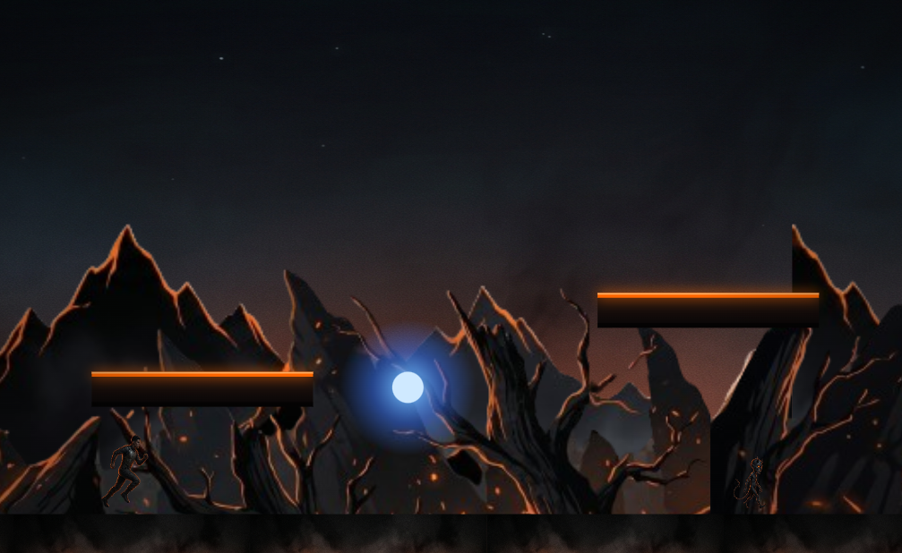

# INABALÁVEL — Prompts de arte (imagens do jogo)

Arte pro jogo 2 ([inabalavel.html](inabalavel.html)). O motor **já está preparado** pra usar estas imagens:
basta salvar cada PNG no caminho indicado que ele troca a forma geométrica pela imagem automaticamente.
**Se a imagem não existir, ele desenha a forma atual** — então pode gerar e subir uma de cada vez, sem quebrar nada.

> 🎨 **Direção de arte:** sombrio cinematográfico estilo *Limbo / Inside* encontrando *dark fantasy*.
> Quase-preto, sombras profundas, **luz de brasa laranja #FF6600**, névoa, alto contraste.
> Tema: guerra espiritual / as tentações de *Cartas de um Diabo a Seu Aprendiz*.
> Identidade CRJ: **preto + laranja** (azul frio SÓ nos elementos de "distração").

## ⚙️ Regras técnicas (importantes)

- **Personagens, inimigos, itens, porta** → PNG com **fundo TRANSPARENTE** (alpha). Se a ferramenta não fizer transparente, gere sobre **fundo verde chroma `#00FF00`** liso pra recortar depois. Vista de **lado (perfil)**, figura inteira no quadro, virada **pra direita**.
- **Enquadre o personagem PREENCHENDO o quadro** (margem transparente mínima), com os **pés rentes à borda inferior** e a cabeça perto do topo. Margem sobrando = personagem pequeno no jogo (o motor desenha o quadro inteiro). Se já gerou com muita margem, **corte bem rente** antes de salvar.
- **Fundos de parallax (far/near)** → PNG **transparente em cima** (só as montanhas/silhuetas opacas), e **emendável na horizontal** (tileable: a borda direita encaixa na esquerda).
- **Texturas de chão/plataforma** → **emendáveis na horizontal** (tileable).
- **Sem texto, sem UI, sem moldura, sem marca d'água, sem logo.**

> 💬 **Dica pro Gemini (Nano Banana):** ele prefere prompts **CURTOS e diretos** e brilha **EDITANDO uma imagem existente** — anexe o sprite e peça *"mude X, mantenha o resto"*, depois refine **na conversa** uma coisa por vez (*"deixa de perfil"*, *"roupa branca"*, *"fundo transparente"*). Pra manter o mesmo personagem em poses novas, sempre **parta da imagem aprovada**, não do texto.

## 📁 Caminhos dos arquivos (exatos)

| Arquivo | O que é |
|---|---|
| `images/inabalavel/bg/m1-sky.png` | céu/atmosfera de fundo (Mundo 1) |
| `images/inabalavel/bg/m1-far.png` | montanhas distantes (parallax, tileable) |
| `images/inabalavel/bg/m1-near.png` | silhuetas próximas (parallax, tileable) |
| `images/inabalavel/tiles/m1-ground.png` | textura do chão (tileable) |
| `images/inabalavel/tiles/m1-platform.png` | plataforma flutuante (tileable na horizontal) |
| `images/inabalavel/sprites/player.png` | o Cadete (herói) |
| `images/inabalavel/sprites/m1-imp.png` | demoniozinho (inimigo do Mundo 1) |
| `images/inabalavel/sprites/wormwood.png` | CHEFÃO Wormwood |
| `images/inabalavel/sprites/verse.png` | versículo (coletável) |
| `images/inabalavel/sprites/shield.png` | Escudo da Fé (power-up) |
| `images/inabalavel/sprites/orb.png` | orbe da distração (perigo) |
| `images/inabalavel/sprites/door.png` | porta de saída |
| `images/inabalavel/sprites/guia.png` | Guia Espiritual (retrato; dica antes do chefão) |

---

## 🎬 MASTER STYLE PROMPT (cole primeiro, uma vez)

```
Vou gerar uma série de imagens para um jogo 2D de plataforma chamado INABALÁVEL, sobre guerra
espiritual inspirado em "Cartas de um Diabo a Seu Aprendiz" (C.S. Lewis). Para TODAS as imagens:

ESTILO:
- Arte de jogo 2D, sombrio e cinematográfico, estilo "Limbo / Inside" + dark fantasy
- Fundos quase pretos, sombras profundas, NÉVOA, alto contraste
- Iluminação de BRASA laranja (#FF6600) como luz dramática (rim light) nas bordas das formas
- Paleta coesa: preto, carvão, vermelho-brasa, laranja. Azul frio SÓ em elementos de "distração"
- Pintura digital limpa, silhuetas legíveis, leve grão de filme, atmosfera de fim de mundo

PROIBIDO: texto, números, UI, HUD, moldura, borda, marca d'água, logo, assinatura.

Confirme que entendeu. Vou pedir uma imagem por vez, dizendo o enquadramento e o fundo (transparente ou cena).
```

---

## 🏔️ FUNDOS — Mundo 1 (A Distração)

### `bg/m1-sky.png` — céu de fundo (1920×1080, imagem cheia)
```
Céu/atmosfera noturna ao fundo de um vale infernal, SEM chão e SEM personagens.
Topo quase preto azulado descendo para um brilho de brasa laranja-avermelhado no horizonte,
como um incêndio distante atrás da névoa. Poucas estrelas apagadas, fumaça subindo.
Pintura atmosférica, suave, desfocada (é a camada mais ao fundo). 16:9, imagem cheia (sem transparência).
```

### `bg/m1-far.png` — montanhas distantes (2048×768, TILEABLE horizontal, topo transparente)
```
Cordilheira de picos/montanhas afiadas em SILHUETA quase preta, vista distante.
Fina luz de brasa laranja delineando o topo dos picos. Névoa entre as montanhas.
IMPORTANTE: fundo TRANSPARENTE acima das montanhas (PNG alpha) e a imagem deve ser EMENDÁVEL
na horizontal (a borda direita encaixa perfeitamente na esquerda, pra repetir em loop). Sem personagens.
```

### `bg/m1-near.png` — silhuetas próximas (2048×640, TILEABLE horizontal, topo transparente)
```
Silhuetas mais próximas e mais escuras: rochas pontiagudas, árvores mortas retorcidas,
algumas brasas/faíscas alaranjadas flutuando no ar. Mais detalhe e mais escuro que a camada distante.
Fundo TRANSPARENTE acima das silhuetas (PNG alpha), EMENDÁVEL na horizontal (loop perfeito). Sem personagens.
```

---

## 🧱 CHÃO E PLATAFORMAS — Mundo 1

### `tiles/m1-ground.png` — chão (512×512, TILEABLE)
```
Textura de chão de jogo 2D: terra/rocha escura, rachada e chamuscada, com FENDAS brilhando
em brasa laranja por dentro. Borda SUPERIOR com uma linha de brasa acesa (como crosta quente).
Escura, sombria. A textura deve ser EMENDÁVEL nos quatro lados (tileable). Sem personagens, sem texto.
```

### `tiles/m1-platform.png` — plataforma flutuante (512×128, TILEABLE horizontal)
```
Uma plataforma/saliência horizontal de jogo: pedra escura e madeira carbonizada, borda superior
iluminada por brasa laranja quente. Vista de frente, fina e comprida. EMENDÁVEL na horizontal
(pra repetir e formar plataformas de vários tamanhos). Fundo transparente. Sem texto.
```

---

## 🦸 PERSONAGEM (com animação)

### ⭐ Rota recomendada: sprite sheet por IA (1 imagem → animação)

O motor agora **fatia sprite sheets** (tiras de quadros). Em vez de gerar pose por pose no Gemini
(que perde a consistência), use uma ferramenta feita pra isso: **AutoSprite** (autosprite.io),
**Spritesheets.ai**, **PixelLab** ou **Layer**. Fluxo:

1. Faça upload do **seu cadete** (1 imagem boa) na ferramenta.
2. Peça as animações **`run`**, **`jump`** e **`idle`**.
3. Exporte cada uma como **tira HORIZONTAL** (uma linha só), **PNG transparente**, com os quadros
   **quadrados** (mesma altura e largura por quadro) — assim o motor autodetecta a quantidade.
4. Salve com estes nomes:

| Arquivo | Animação |
|---|---|
| `sprites/player-run.png` | tira de corrida (vários quadros) |
| `sprites/player-jump.png` | tira de pulo (1+ quadros) |
| `sprites/player-idle.png` | tira de parado (1+ quadros) |
| `sprites/player-crouch.png` | tira de agachado |
| `sprites/player-attack.png` | tira de ataque com a espada |
| `sprites/player.png` | pose única (reserva, se faltar alguma anim) |

> ✅ Hoje estão configuradas como **grade 5×5 (25 quadros)** — formato que a **AutoSprite** exporta.
> Se você exportar em outra grade (ex.: 3×3) ou tira de 1 linha, me diga o formato que eu ajusto (é 1 linha no código).
> Tudo é opcional: o que faltar cai na pose única `player.png`.

---

### Alternativa manual (pose por pose no Gemini)

Se preferir gerar à mão, a imagem de corrida vira o `player.png` e você gera as outras poses como
imagens soltas. Frame de corrida (base):

```
Herói de jogo 2D em VISTA DE LADO (perfil), virado para a DIREITA, corpo inteiro, em pose de
corrida determinada. Um jovem cadete cristão: traje CLARO / BRANCO (uniforme ou túnica branco-gelo)
com um peitoral/armadura PRATEADA gravada com uma CRUZ (alusão à Armadura de Deus). O branco
CONTRASTA FORTE com o ambiente sombrio — ele é como uma luz no escuro. Luz de brasa laranja
(#FF6600) contornando de leve as bordas (rim light quente sobre o branco), rosto sério e corajoso.
Enquadre PREENCHENDO o quadro, pés rentes à base inferior. FUNDO TOTALMENTE TRANSPARENTE (PNG alpha).
Sem chão, sem sombra solta, sem texto.
```

> 🔑 **Consistência é tudo.** Gere as outras poses usando a 1ª imagem como REFERÊNCIA e diga:
> *"MESMO personagem, mesma roupa, mesmas cores, mesmo rim light laranja, mesmo tamanho e enquadramento,
> pés na MESMA linha de base; mude APENAS a pose."* Mesma resolução (512×512) nas quatro.

| Arquivo | Estado | Pose |
|---|---|---|
| `sprites/player.png` | correndo (A) | a que você já tem |
| `sprites/player-run.png` | correndo (B) | passada OPOSTA (a outra perna à frente) |
| `sprites/player-jump.png` | no ar | impulso de pulo, joelhos recolhidos |
| `sprites/player-idle.png` | parado | de pé, firme (opcional) |

**Corrida B** (`player-run.png`):
```
MESMO personagem do anterior (mesmo cadete, mesma roupa BRANCA com peitoral prateado de cruz, mesmas
cores, mesmo rim light laranja), VISTA DE LADO virado pra DIREITA, corpo inteiro. Agora na PASSADA OPOSTA
da corrida: a OUTRA perna à frente, braços invertidos. Mesmo tamanho, pés na mesma linha de base.
FUNDO TRANSPARENTE. Sem texto.
```
**Pulo** (`player-jump.png`):
```
MESMO personagem (mesma roupa, cores e rim light laranja), VISTA DE LADO virado pra DIREITA, corpo
inteiro, em POSE DE PULO: corpo subindo, joelhos dobrados/recolhidos, um braço pra cima, dinâmico.
Mesmo tamanho e enquadramento, pés na mesma base. FUNDO TRANSPARENTE. Sem texto.
```
**Parado** (`player-idle.png`, opcional):
```


```

---

## 👹 INIMIGO — Mundo 1

### `sprites/m1-imp.png` — demoniozinho (384×384, FUNDO TRANSPARENTE, perfil pra direita)
```
Pequeno demônio capeta (lacaio do tentador) em VISTA DE LADO, virado pra DIREITA, corpo inteiro,
andando. Criatura pequena, magra e travessa, pele escura, dois chifrinhos, OLHOS brilhando em
laranja-brasa, cauda fina. Sombrio mas com cara de "encrenca". Luz de brasa contornando.
FUNDO TRANSPARENTE (PNG alpha). Sem chão, sem texto.
```

---

## 😈 CHEFÃO — Mundo 1

### `sprites/wormwood.png` — Wormwood (640×800, FUNDO TRANSPARENTE, de frente/3-4)
```
WORMWOOD, o demônio tentador-aprendiz de "Cartas de um Diabo a Seu Aprendiz", como CHEFÃO de jogo.
Demônio grande, alto, esguio e ameaçador — meio "burocrata do inferno", elegante e sinistro ao
mesmo tempo. Chifres grandes, olhos brilhando em brasa, aura de fumaça e brasa laranja ao redor,
mãos compridas. Pose intimidadora, encarando o jogador (vista de frente levemente 3/4).
Estilo sombrio cinematográfico. FUNDO TOTALMENTE TRANSPARENTE (PNG alpha). Sem chão, sem texto.
```

---

## 🕊️ GUIA ESPIRITUAL

### `sprites/guia.png` — retrato do mentor (512×512, FUNDO TRANSPARENTE, rosto/busto centralizado)
```
Retrato (busto, rosto centralizado, tipo foto de avatar) de um mentor espiritual cristão:
pessoa serena, sábia e acolhedora, olhar firme e gentil, vestes simples e claras. Luz quente
suave ao redor (uma luz de esperança no escuro), leve brilho dourado-alaranjado. Estilo coeso
com o jogo (pintura digital sombria, mas o guia é o ponto de luz). FUNDO TRANSPARENTE. Sem texto.
```
> Aparece num círculo, então gere **rosto/busto centralizado**. Se não existir, o jogo mostra um 🕊️ no lugar.

## ✨ ITENS

### `sprites/verse.png` — versículo coletável (256×256, FUNDO TRANSPARENTE)
```
Ícone de coletável de jogo: uma pequena CRUZ luminosa dourado-alaranjada flutuando, irradiando
luz quente, com leve partícula de brilho ao redor (como uma moeda sagrada). Limpo, brilhante,
legível. FUNDO TRANSPARENTE (PNG alpha). Sem texto.
```

### `sprites/shield.png` — Escudo da Fé (256×256, FUNDO TRANSPARENTE)
```
Power-up: o ESCUDO DA FÉ — um escudo redondo/scutum romano, metal escuro com emblema central de
cruz ou chama, brilho sagrado dourado-alaranjado contornando (esse pode ter um toque de dourado,
é a Armadura de Deus). Levemente flutuante e radiante. FUNDO TRANSPARENTE (PNG alpha). Sem texto.
```

### `sprites/orb.png` — orbe da distração (256×256, FUNDO TRANSPARENTE)
```
Perigo "distração": uma ESFERA hipnótica de luz FRIA azul-branca, como o brilho de uma notificação
de celular no escuro, com halo/glow azulado e um núcleo branco brilhante. Sensação de tela de
celular puxando a atenção. (Único elemento azul do jogo, de propósito.) FUNDO TRANSPARENTE. Sem texto.
```

### `sprites/door.png` — porta de saída (384×512, FUNDO TRANSPARENTE)
```
Uma PORTA/portal de saída de fase: batente de pedra escura emoldurando uma luz quente laranja
que escapa por dentro (como uma saída de esperança no meio do escuro). Vertical, vista de frente.
Brilho de brasa nas bordas. FUNDO TRANSPARENTE (PNG alpha). Sem texto na porta.
```

---

## 📋 Workflow

1. Cole o **Master Style Prompt** no ChatGPT (GPT-Image/DALL-E) ou na ferramenta que usar.
2. Gere uma imagem por vez, salvando no **caminho exato** da tabela acima.
3. Para sprites, garanta o **fundo transparente** (ou recorte o chroma verde).
4. Commit + push → a Action faz deploy → o jogo passa a mostrar a imagem no lugar da forma.
5. Não precisa gerar tudo de uma vez: cada PNG que faltar continua como forma geométrica.

## 🌑 MUNDO 2 — OS APETITES (assets novos, prontos pra gerar)

O Mundo 2 **já existe e roda** (3 fases mais difíceis + chefe), por enquanto **reaproveitando o cenário do
Mundo 1**. Quando gerar a arte abaixo, salve nos caminhos `m2-*` e, no [inabalavel.html](inabalavel.html),
no bloco `theme.assets` do **Mundo 2**, troque `m1-` por `m2-` (e o boss por `sprites/gula.png` se criar um vilão novo).
Tema: **gula / apetites** — fartura podre, decadência, cor enjoativa (âmbar doente, verde-podre) ainda na chave sombria.

| Arquivo | O que gerar |
|---|---|
| `bg/m2-sky.png` | céu de fartura apodrecida (1920×1080, cheio) |
| `bg/m2-far.png` | silhueta distante (tileable, topo transparente) |
| `bg/m2-near.png` | silhueta próxima (tileable, topo transparente) |
| `tiles/m2-ground.png` | chão temático (tileable) |
| `tiles/m2-platform.png` | plataforma (não usada hoje — o motor desenha; opcional) |
| `sprites/m2-imp.png` | inimigo do Mundo 2 (perfil, transparente) |
| `sprites/gula.png` | (opcional) chefe novo, se quiser trocar o Wormwood |

**`bg/m2-sky.png`:**
```
Céu de um salão/vale de FARTURA APODRECIDA ao fundo, SEM chão e SEM personagens. Tons de âmbar
doentio e verde-podre, fumaça gordurosa, brilho enjoativo no horizonte. Atmosfera de excesso e
decadência, ainda sombria e cinematográfica. 16:9, imagem cheia.
```
**`bg/m2-far.png` / `bg/m2-near.png`:** mesmas regras do Mundo 1 (silhueta, topo transparente, tileable), trocando os picos de rocha por **silhuetas de banquete decadente / vasos e pilhas tortas**, com brilho âmbar-podre no lugar da brasa.
```
Silhueta [distante / próxima] em quase-preto de um cenário de excesso decadente (pilhas, taças,
formas tortas de banquete), com brilho âmbar-doentio nas bordas. FUNDO TRANSPARENTE acima,
EMENDÁVEL na horizontal (loop). Sem personagens.
```
**`tiles/m2-ground.png`:**
```
Textura de chão de jogo 2D, EMENDÁVEL (tileable): superfície de excesso apodrecido (lama gordurosa /
restos), escura, com FENDAS brilhando em âmbar-doentio. Borda superior com uma linha de brilho.
Sem personagens, sem texto.
```
**`sprites/m2-imp.png`:**
```
Pequeno demônio da GULA, vista de lado virado pra direita, corpo inteiro: criatura inchada/gananciosa,
pele escura, olhos brilhando em âmbar, expressão voraz. Luz âmbar-podre contornando. FUNDO TRANSPARENTE.
```

## 🌍 Próximos mundos (mesmo padrão)

Cada mundo novo é só trocar o prefixo `m1-` e re-tematizar a paleta:
- **Mundo 2 — Os Apetites (Gula):** `m2-sky/far/near`, `m2-ground` (banquete podre/decadente), `m2-imp`, chefão `sprites/gula.png`. Paleta mais quente/enjoativa (âmbar, verde-podre).
- **Mundo 3 — O Orgulho:** ✅ JÁ EXISTE e roda (demônios atiradores de magia roxa + chefe com 6 vidas e 6 magias por rajada; reaproveita cenário m1). Pra reskin: `m3-*` (espelhos, mármore frio, paleta roxo/prata) e chefão `sprites/orgulho.png`.
- (e assim por diante: Covardia, Mornidão…)

O `player.png`, `verse.png`, `shield.png`, `orb.png` e `door.png` são **compartilhados** entre os mundos (gera uma vez).
